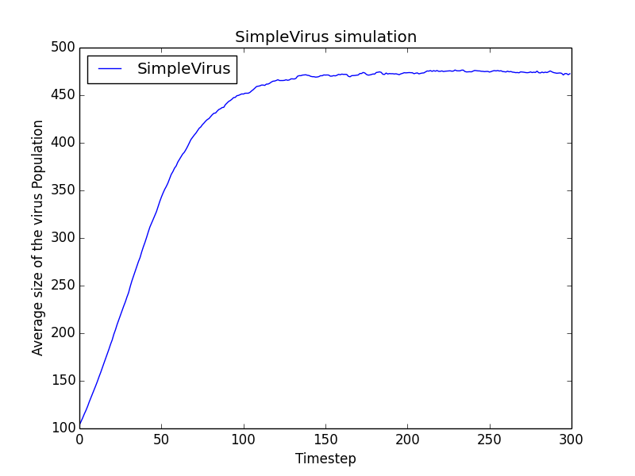
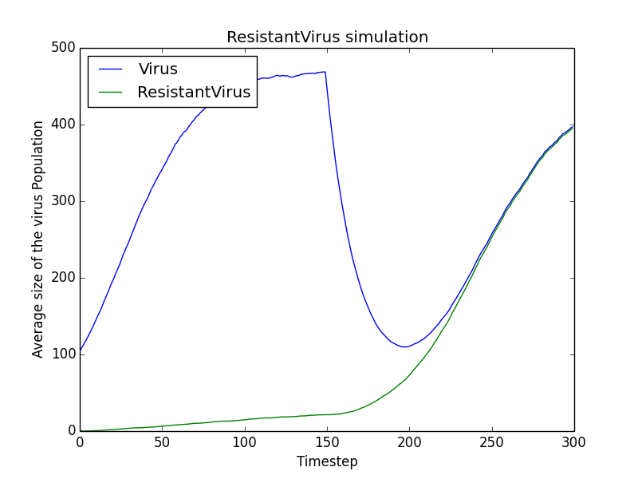

# Computational thinking and Data Science: Final Project #

- Origin: finalProject.pdf
- Issue: [https://github.com/joyhuang9473/reading-list/issues/90](https://github.com/joyhuang9473/reading-list/issues/90)

## Background: ##

> "viruses replicate extremely quickly"

- The population of viruses would increase over time.

> "populations of viruses can undergo substantial evolutionary changes within a single patient over the course of treatment. "

- The viruses are in a patient.
- The population of viruses would "change"( increase or decrease) over the course of treatment.

> "a virus population to acquire genetic resistance to therapy quickly. "

- The viruses can acquire resistance

> "we will make use of simulations to explore the effect of introducing drugs on the virus population and determine how best to address these treatment challenges within a simplified model."

> "In this project, we will implement a highly simplified stochastic model of virus population dynamics."

> "we’ll be looking at a detailed simulation of the spread of a virus within a person. "

## Problem 1: Implementing a simple simulation (no drug treatment) ##

- patient: does not take any drugs
- viruses: do not acquire resistance

### Code ###

(in ps3b.py)

Class SimpleVirus  # which maintains the state of a single virus particle. 

- \__init__()
- getMaxBirthProb()
- getClearProb()
- doesClear() # check does it clear?
- reproduce()
  - returning a new instance of SimpleVirus with probability: **self.maxBirthProb * (1 - popDensity)**.
  - if the virus particle does not reproduce, raises a **NoChildException**

Note:

- Use **random.random()** for generating random numbers to ensure that your results are consistent with ours.
- **self.maxBirthProb** is the birth rate under optimal conditions (the virus population is negligible relative to the available host cells so there is ample nourishment available).
- **popDensity** = current virus population / maximum virus population

(in ps3b.py)

Class Patient # which maintains the state of a virus population associated with a patient.

- update (one time step, iterating: all the virus particles)
  - modifies the state of the virus population for a single time step and returns the total virus population at the end of the time step.
  - should  first decide which virus particles are cleared and which survive by making use of the doesClear method of each SimpleVirus instance
  - updated  the **collection** of SimpleVirus instances.
  - should then call the reproduce method for each virus particle.
  - After iterating through all the virus particles, the update method returns the number of virus particles in the patient at the end of the time step.
  - (calculate the viruses' **popDensity**)

Note:

- A patient has the **collection** of SimpleVirus instances.
- At every time step of the simulation, each virus particle has a  fixed probability of being cleared (destroy)
  - If the virus particle is not cleared, it is considered for **reproduction**.
- The virus population should never exceed **maxPop**.
- original article:
  - To summarize, update should  first decide which virus particles are cleared and which survive by making use of the doesClear method of each SimpleVirus instance, then update the collection of SimpleVirus instances accordingly. With the surviving SimpleVirus in- stances, update should then call the reproduce method for each virus particle. Based on the population density of the surviving SimpleVirus instances, reproduce should either return a new instance of SimpleVirus representing the o spring of the virus particle, or raise a NoChildException indicating that the virus particle does not reproduce during the current time step.  e update method should update the a ributes of the patient appropriately under either of these conditions.

## Problem 2: Running and analyzing a simple simulation (no drug treat- ment) ##

Code:

- numViruses = 100
- maxPop (maximum sustainable virus population) = 1000
- maxBirthProb (maximum reproduction probability for a virus particle) = 0.1
- clearProb (maximum clearance probability for a virus particle) = 0.05

(in ps3b.py)

Method simulationWithoutDrug(numViruses, maxPop, maxBirthProb, clearProb, numTrials)

- instantiates a Patient
- simulates changes to the virus population for 300 time steps (i.e., 300 calls to update)
- **plots** the average size of the virus population as a function of time; that is, the x-axis should correspond to the **number of elapsed time steps**, and the y-axis should correspond to **the average size of the virus population**

(your simulation should be instantiating **one Patient** with a list of 100 SimpleVirus instances)

(Each SimpleVirus instance in the viruses list should be **initialized** with the proper values for **maxBirthProb** and **clearProb**.)

Note:

- The population at time = 0 is the population after the first call to update.
- Don’t forget to include axes labels, a legend for the curve, and a title on your plot.
- Use pylab to produce a plot (with a single curve) that displays the average result of running the simulation for many trials. Make sure you run enough trials so that the resulting plot does not change much in terms of shape and time steps taken for the average size of the virus population to become stable.
- from ps3b_precompiled_27 import *

## Problem 3: Implemening a simulation with drugs ##

(in ps3b.py)

Code:

Class ResistantVirus # (a subclass of SimpleVirus) maintains the state of a virus particle’s drug resistances, and accounts for the inheritance of drug resistance traits to offspring.

Class TreatedPatient # ( a subclass of Patient.) accounts for the use of drug treatments and manages a **collection** of **ResistantVirus instances**.

- addPrescription()

Note:

- The drugs prevent those virus particles (lacking resistance to the drug) from reproducing
- Virus particles with resistance to the drug continue to reproduce normally.

## Problem 4: Running and analyzing a simulation with a drug**

- create a TreatedPatient instance with:
  - viruses, a list of 100 ResistantVirus instances, each one should be initialized with:
    - maxBirthProb, maximum reproduction probability for a virus particle = 0.1
    - clearProb, maximum clearance probability for a virus particle = 0.05
    - resistances, The virus’s genetic resistance to drugs in the experiment = {’guttagonol’: False}
    - mutProb, probability of a mutation in a virus particle’s offspring = 0.005 (the probability of the offspring acquiring or losing resistance to a drug)
  - maxPop, maximum sustainable virus population = 1000

- Run a simulation that consists of 150 time steps, followed by the addition of the drug, gut-tagonol, followed by another 150 time steps
- Create one plot that records both the average total virus population and the average pop- ulation of gu agonol-resistant virus particles over time.

Code

(in ps3b.py)

Method simulationWithDrug(numViruses, maxPop, maxBirthProb, clearProb, resistances, mutProb, numTrials)

- As with problem 2, perform up to 100 trials

Reference:

- [Basic Plotting with Pylab](http://jakevdp.github.io/mpl_tutorial/tutorial_pages/tut1.html) 
- [Python: Class](https://docs.python.org/2/tutorial/classes.html#classes)
- [Python: Data Structures](https://docs.python.org/2/tutorial/datastructures.html)
  - list
  - filter

Trouble shooting:

- [No plot window in matplotlib](http://stackoverflow.com/questions/2130913/no-plot-window-in-matplotlib)

## Result ##

### simulationWithoutDrug ###

    simulationWithoutDrug(100, 1000, 0.1, 0.05, 100)

### simulationWithDrug ###

    simulationWithDrug(100, 1000, 0.1, 0.05, {"guttagonol": False}, 0.005, 100)

